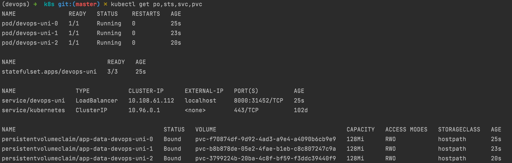
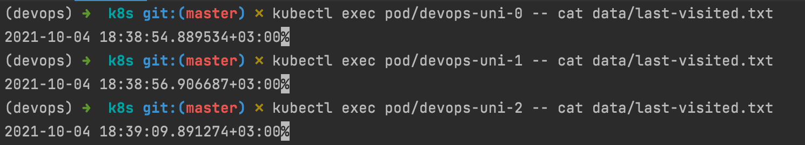

# lab 13

Outputs are different because PVs are not shared, but created for each pod individually.

## ordering

Ordering guarantees are not important in this case since pods are not dependent on each other, meaning that they can operate on their own and start up at any time relative to other pods.

To make StatefulSet controller to launch or terminate all Pods in parallel, use `podManagementPolicy: "Parallel"`.
