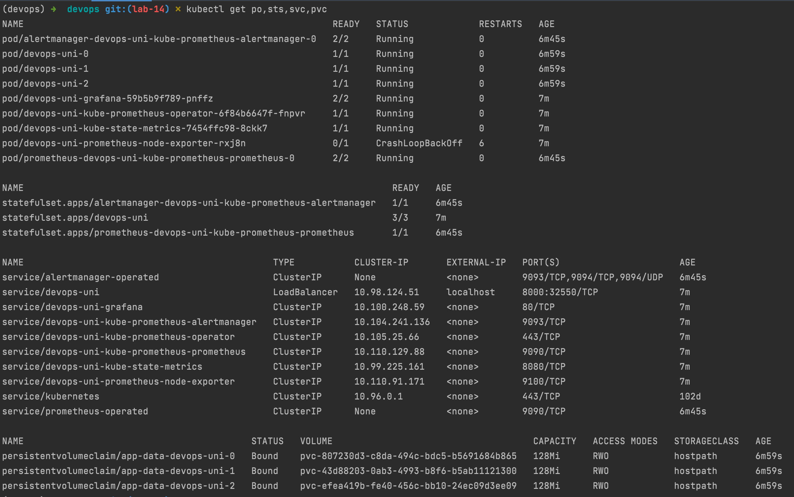
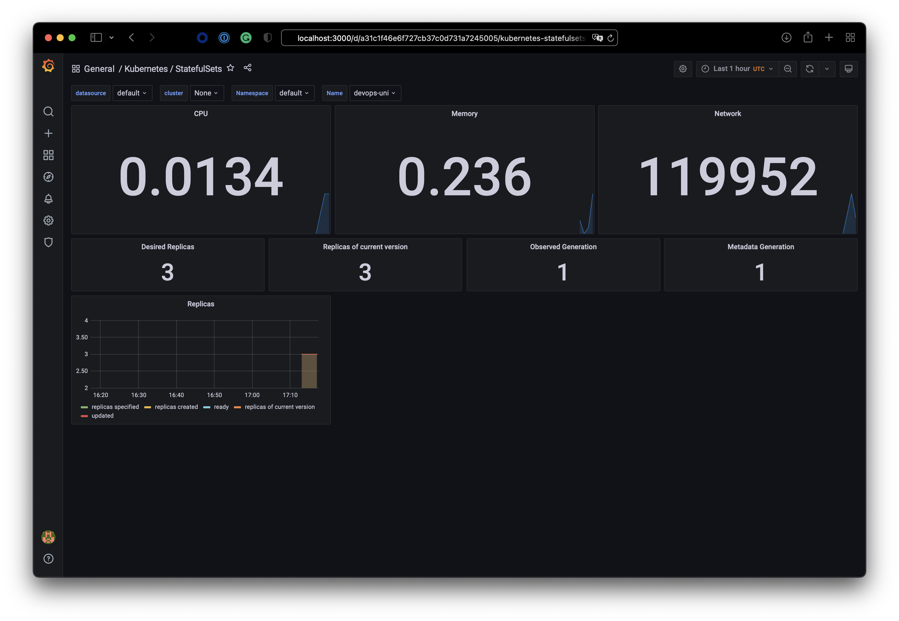
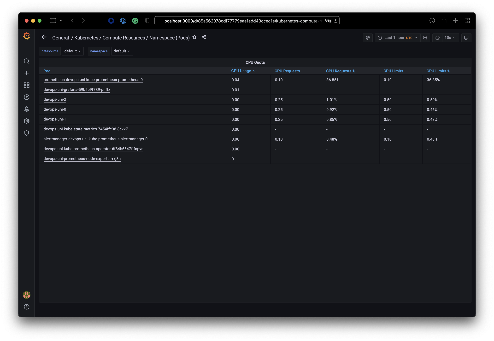
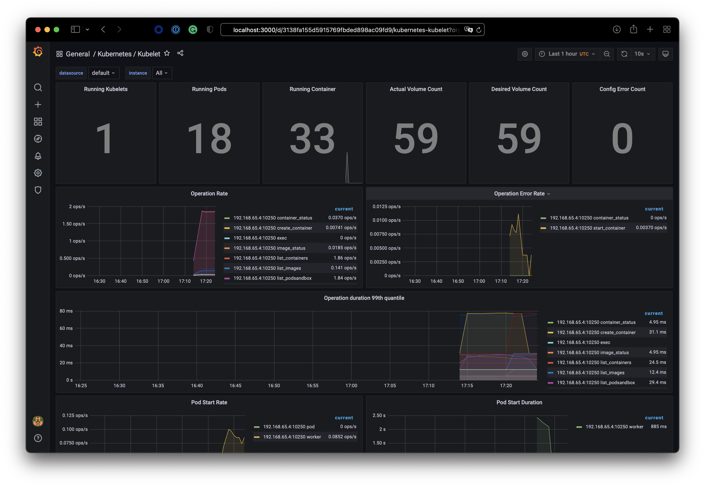
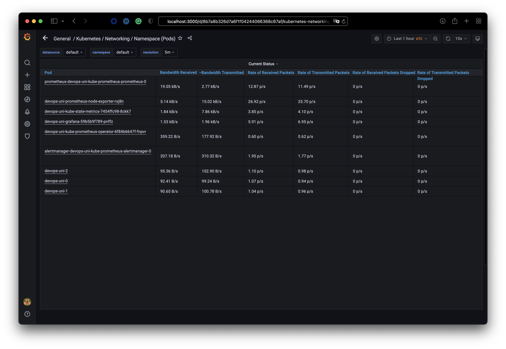
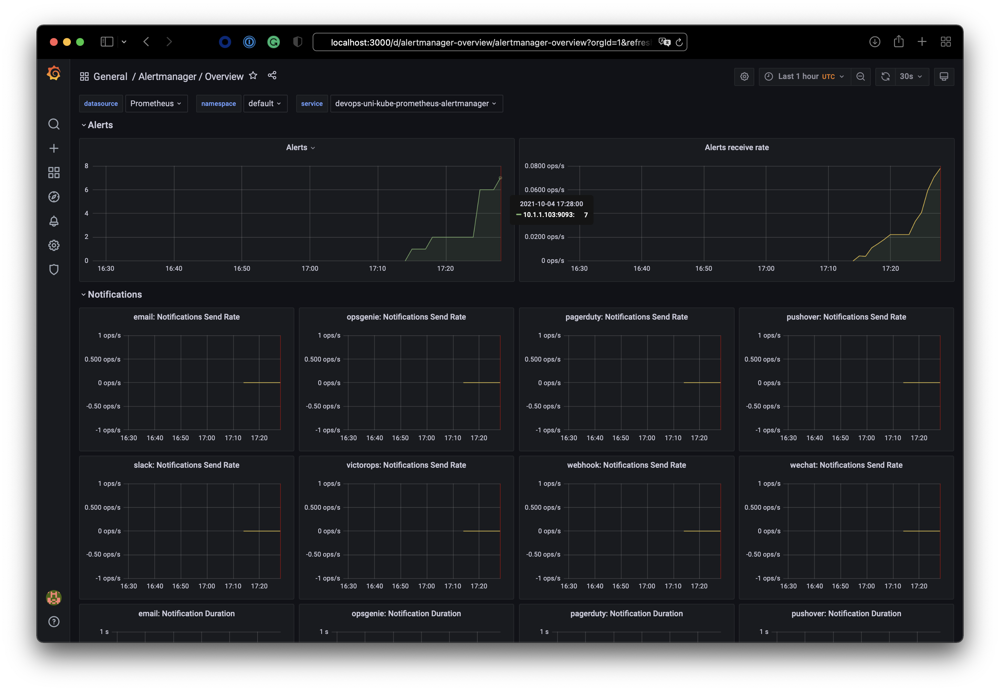
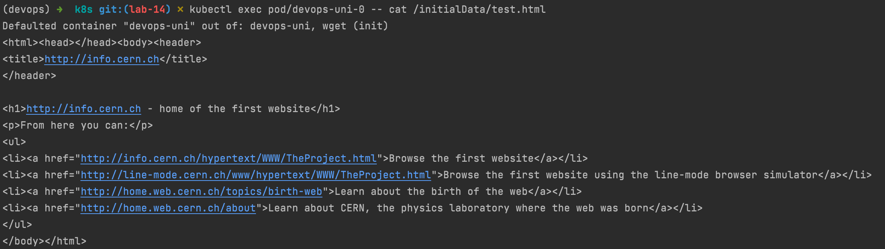

# lab 14

## kube-prometheus-stack components

Grafana = tool that visualizes data

Prometheus = tool that collects metrics

Alertmanager = tool that manages alerts (grouping, silencing, notifying)

Node Exporter = prometheus compliant tool that collects hardware metrics

Kube State Metrics = tool that collects metrics from kubernetes nodes

## grafana dashboards

### check how much CPU and Memory your StatefulSet is consuming

### check which Pod is using CPU more than others and which is less in the default namespace

### check how many pods and containers actually ran by the Kubelet service

### check which Pod is using network more than others and which is less in the default namespace

### check how many alerts you have

## initContainers

