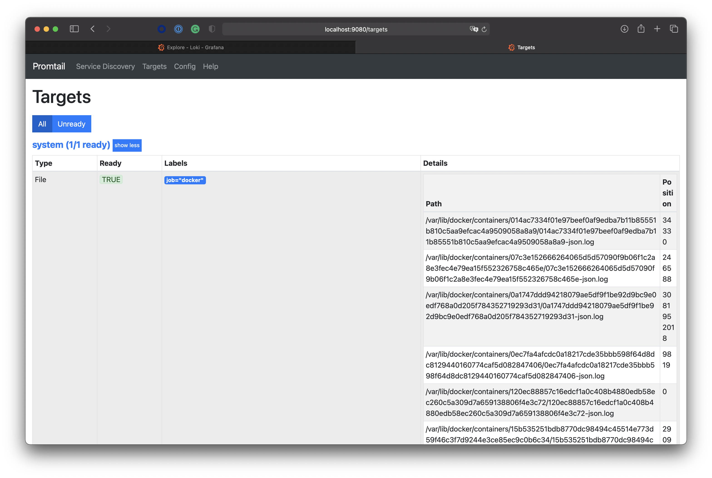

# Logging

## screenshots

## best practices

- establish a consistent format for logs
- use some persistent storage to back up your logs (e.g. AWS S3)
- employ log rotation
- don't log sensitive info like tokens, passwords, etc.
